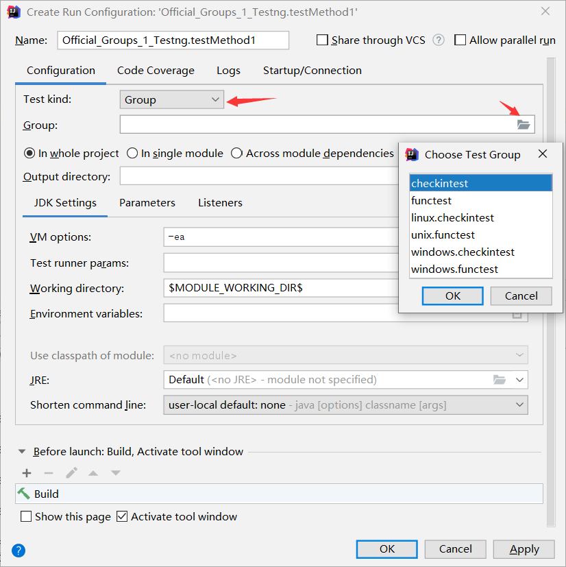

# testng-example

+ [Github, Testng](https://github.com/cbeust/testng)
+ [testng.org](https://testng.org/doc/)

- [易百教程 - Testng](https://www.yiibai.com/testng/)


## Annotation

### `org.testng.annotations.@Test`

### `org.testng.annotations.@DataProvider`

### `org.testng.annotations.@Parameters`

### `org.testng.annotations.@Optional`

- [在TestNG中传递参数给方法使用](https://blog.csdn.net/libertine1993/article/details/80697470)

```
@Test
@Parameters("browser")
public void openBrowser(@Optional("chrome")String browser){
    // ...
}
```
一般与`@Parameters`配合使用，如果在`testng.xml`文件中没有找到名为"browser"的参数，测试方法将接受在@Optional注解中指定的默认值："chrome"。

### `org.testng.annotations.@Test#groups()`
+ [testng.org, 5.2-Test groups ~ 5.5-Partial groups](https://testng.org/doc/documentation-main.html)

- [testng中groups的使用](https://www.jianshu.com/p/e0da51a868f7)
- [TestNG中的组groups概念](https://blog.csdn.net/taiyangdao/article/details/52141417)

1. IDEA 中直接右键运行xml，例如`testng-Official_Groups_1.xml`、`testng-Official_Groups_2.xml`、`testng-Official_Groups_Nested.xml`。

2. IDEA 中可以不定义xml，而是通过`Create Run Configuration`中指定 group （但貌似只能做到很简单 group，没有xml功能强大）  

